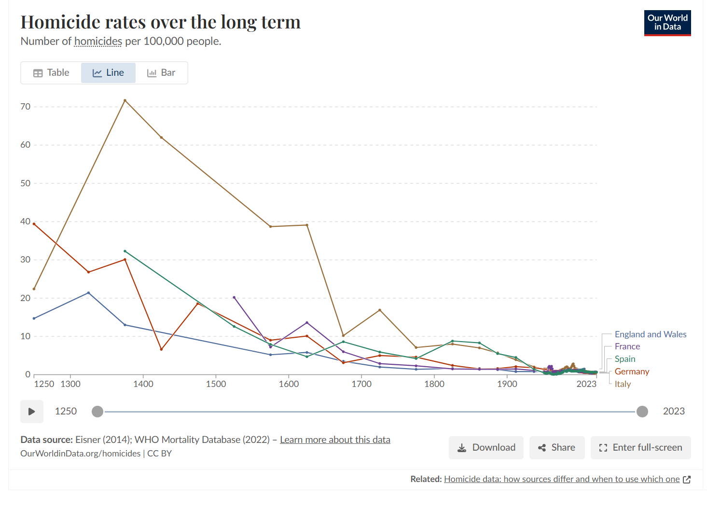
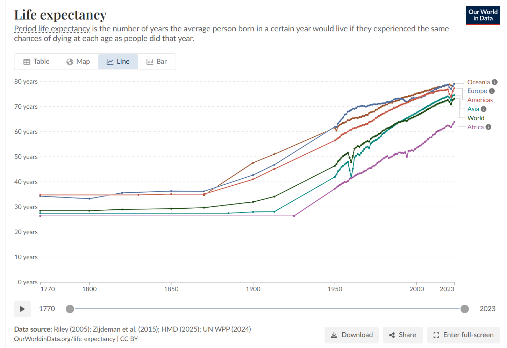
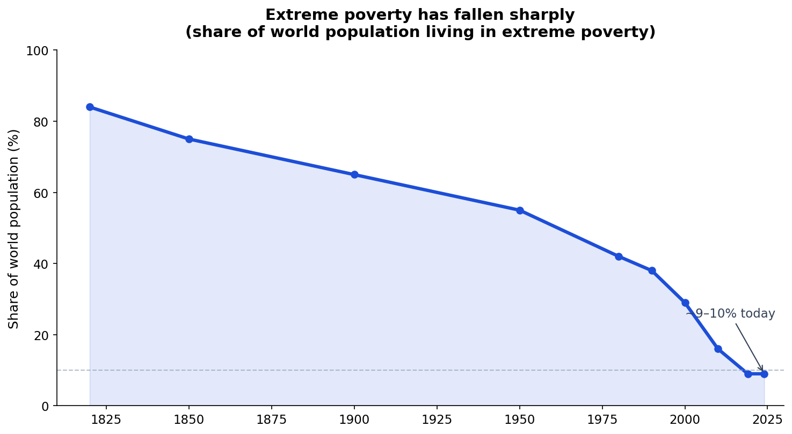
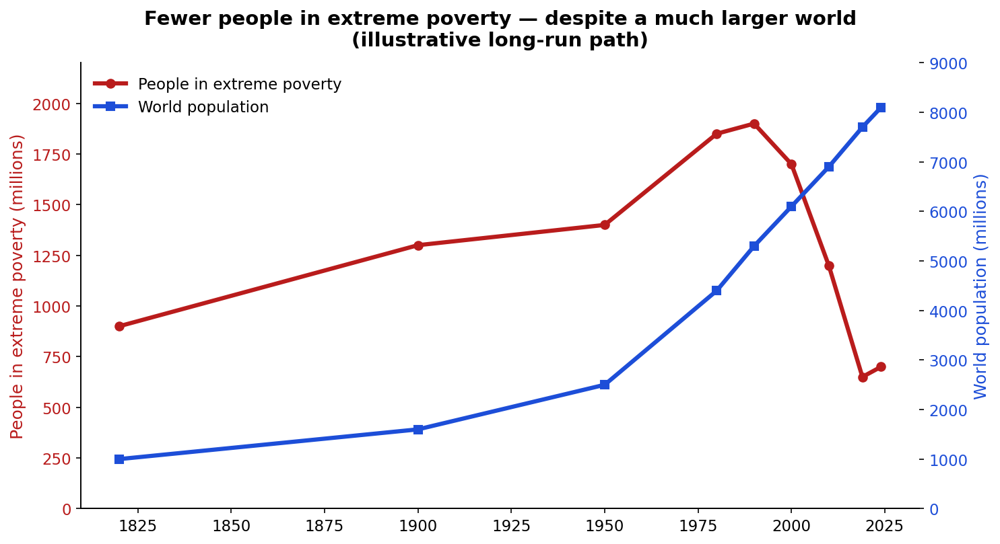
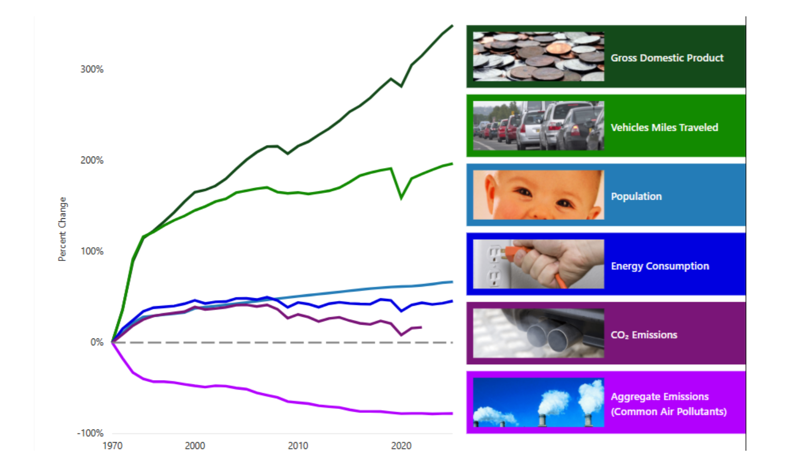

## Today

- Long-run trends in violence, health, and prosperity
- Why the news still feels like permanent crisis
- Why that matters for how we think about government — and about the world

# Why This Matters

## Why This Matters

::: {.custom-style style="font-size: 48px;"}
By the end of today you will explain why long-run declines in violence and rises in health and living standards make a habit of caution before drastic government action rational — even when the news feels like permanent crisis — and why the world (and the United States) are in much better shape than they often seem.
:::

## Bridge

- We have defined government as organized coercive force
- Ethics of when force is justified
- Limits in the founding design and the Bill of Rights
- Today: another reason for long consideration before drastic action

# How It Feels

## The feeling of permanent crisis

::: {.custom-style style="font-size: 55px;"}
Bad news is news — slow improvement is not
:::

## Availability

::: {.custom-style style="font-size: 48px;"}
What is vivid and recent feels more common than it is
:::

# Violence

## Homicide over the long run

{fig-alt="Chart of long-run homicide rates across Western Europe showing large declines from the late Middle Ages to the present" width="95%"}

## Order of magnitude

::: {.custom-style style="font-size: 50px;"}
Medieval rates often 10–40+ per 100,000 — modern Western Europe near 1
:::

# Health

## Life expectancy

{fig-alt="Chart showing global life expectancy rising from around 30 years in 1900 to over 70 years today" width="95%"}

## More than twice as long

::: {.custom-style style="font-size: 50px;"}
Global average ~32 years in 1900 → ~73 years in the 2020s
:::

## Child survival

::: {.custom-style style="font-size: 48px;"}
Pre-modern: large shares of children died before adulthood — every country has improved
:::

# Prosperity

## Extreme poverty — the share

{fig-alt="Line chart showing the share of world population in extreme poverty falling from a large majority historically to around 9 to 10 percent today" width="95%"}

## Despite a much larger world

{fig-alt="Dual-axis chart showing fewer people in extreme poverty even as world population grew substantially" width="95%"}

# Environment (one example)

## Decoupling: pollution vs growth

{fig-alt="EPA chart showing criteria air pollutant emissions declining since 1970 while U.S. GDP, vehicle miles, energy use, and population increased" width="95%"}

## Cuyahoga — then and now

A river that repeatedly caught fire is now fishable and recreational.

# So What

## Progress is not utopia

::: {.custom-style style="font-size: 50px;"}
Remaining problems are real — they are not evidence that the baseline is civilizational collapse
:::

## Habit of caution

::: {.custom-style style="font-size: 48px;"}
When the baseline is historically high peace and prosperity, drastic uses of coercive power still need long consideration before breaking a good result
:::

# Discussion

## Why limit government?

- Government as organized coercive force
- Ethics of the use of force
- Classical liberal challenge: live together peacefully as dignified equals
- Overstatement of problems amid human progress

## Next lecture: Misinformation

## Watch

Channel: [TikTok @us_politics_explained](https://www.tiktok.com/@us_politics_explained)

## Authorship and License

Inspiration: Steven Pinker, *The Better Angels of Our Nature*; Ray Kurzweil, *The Singularity is Nearer*.

- Author: The Politics Tutor
- Channel: [TikTok @us_politics_explained](https://www.tiktok.com/@us_politics_explained)
- License: [CC BY-NC-SA 4.0](http://creativecommons.org/licenses/by-nc-sa/4.0/)
